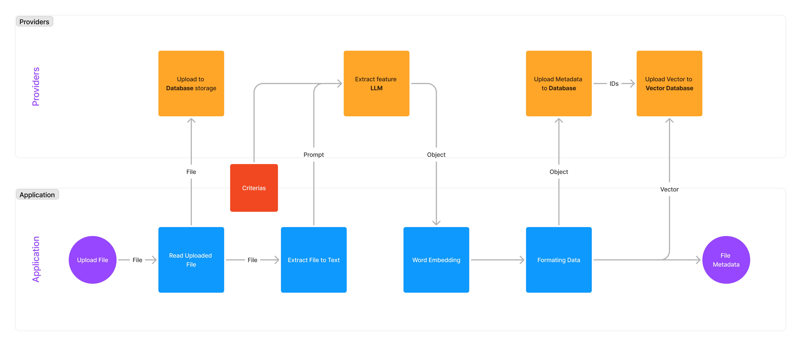
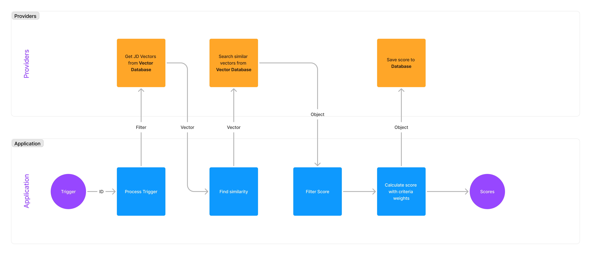
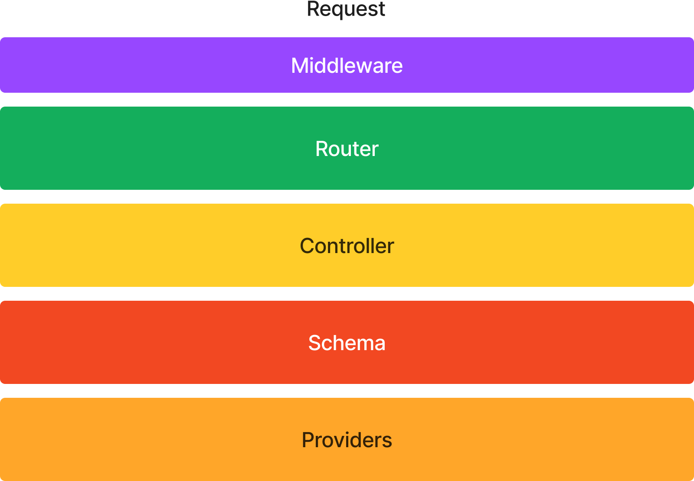

# CVEZ Development Document - Overview

## Technologies

We used variety of technologies to appoarch the solution of matching CV.

1. Back-end Framework. **FastAPI**

   - Quick and high performance API request.
   - Integrated components such as Validation, Middleware, Websocket compared to Flask.
   - Reduce development effort.

2. Database. **MongoDB**

   - Support variety cloud platform.
   - Simple Data structure compared to SQL Database.
   - Large community.

3. Vector Database. **Qdrant**

   - High query performance.
   - Cloud friendly.
   - Simple and well document.

4. Cache. **Redis**

   - Cloud friendly.
   - Support features for caching.
   - Easy to integrated.

5. LLM Framework. **LangChain**

   - More built-in features.
   - Support for variety of LLM.

6. Large Language Model. **OpenAI**

   - High performance, accuracy.
   - Rich language supports.
   - 128K tokens as input context.

7. Embedding. **MxbAI**
   - High accuracy in MTEB leaderboard.
   - Rich language supports.
   - Easy integrated.

## Pipeline

Below is the overview pipeline of how we matching a Job description with CV. It includes 2 stages, Upload & Processing and Matching.

1. Upload & Preprocessing Stage

2. Matching Stage

## Code Structure

In our project, we defined a development pattern as a standard for implementing any features. It includes: Request, Middleware, Router, Controller, Schema, and Providers.

- **Request**: HTTP API Request from User, Postman, Swagger.
- **Middleware**: Process logic goes before main API route. Locate at `apis/<version>/middlewares`. Use for authorize request, roles guard, or password request. Integrate as `FastAPI - Depends`.
- **Router**: Definition of API endpoints. Include input and output validation. Locate at `apis/<version>/routes`.
- **Controller**: Main business logic of app. Locate at `apis/<version>/controllers`.
- **Schema**: Object class represents Data entity, include common method of data entity. Locate at `apis/<version>/schemas`.
- **Providers**: Object class provides wrapper methods for interacting with third-party services such as Cache, Vector Database, etc. Locate at `apis/<version>/providers`.

> **Example workflow**:
>
> 1. User request to `auth` endpoint. It first goes to `auth_middleware` to validate request token.
> 2. Validate request json in `auth` route, and pass data to `controller`.
> 3. In controller, `User` schema and `Project` schema are imported and combined as business logic. It call methods from schema for get or update data.
> 4. In schema, `Database` provider is imported to implement common method interacting with database and call get or update request from schema method.
> 5. After complete actions, return corresponding data to user.

## Algorithm
